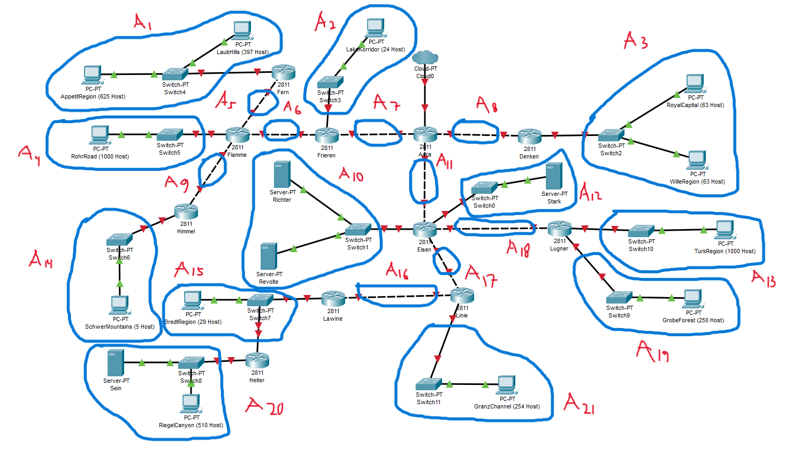
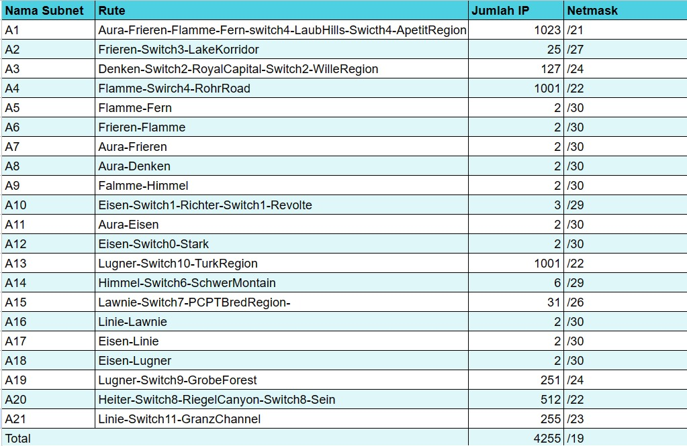

# Jarkom-Modul-4-D30-2023

## Group Member    :
| Nama                              | NRP        |
|-----------------------------------|------------|
|Abdullah Yasykur Bifadhlil Midror  |5025211035  |
|Muhammad Ahyun Irsyada             |5025211251  |

Berikut adalah demo laporan untuk praktikum modul 4

## Topologi
Topologi yang digunakan untuk praktikum modul 4 adalah sebagai berikut.
| <p align="center"> Topologi </p> |
| -------------------------------------------- |
|  |


## Variable Length Subnet Masking (VLSM)
Pada sesi ini kita akan membuat topologi kita pada Cisco Packet Tracer (CPT). Setelah membuat topologi, yang pertama kita lakukan selanjutnya adalah melakukan perhitungan untuk subnetting. Berikut langkah-langkahnya.

### Subnetting
- Lakukan pembagian untuk jumlah subnet yang ada pada topologi yang telah dibuat dan akan didapatkan pembagiannya sebagai berikut.

- Lakukan perhitungan terhadap jumah IP pada tiap-tiap subnet yang telah dibagi.


**Penyelesaian**
- Gunakan image docker `danielcristh0/debian-buster:1.1` untuk membuat project.
- Tambahkan 1 node NAT, 1 node debian untuk Router (Aura).
- Tambahkan 4 node debian yang masing-masing adalah DHCP Server (Himmel), DNS Server (Heiter), DB Server (Denken) dan LB (Eisen).
- Tambahkan 3 node debian sebagai Laravel Worker (Frieren, Flamme, Fern) dan 3 node sebagai PHP Worker (Lawine, Linie, Lugner).
- Terakhir 4 node debian untuk client (Revolte, Richter, Stark, Sein)
- Kemudian pada masing-masing node debian, setting network dengan konfigurasi sebagai berikut `(Prefix IP: 192.206)`:
  1. Aura
  ```
  auto eth0
  iface eth0 inet dhcp
  
  auto eth1
  iface eth1 inet static
  	address 192.206.1.0
  	netmask 255.255.255.0
  
  auto eth2
  iface eth2 inet static
  	address 192.206.2.0
  	netmask 255.255.255.0
  
  auto eth3
  iface eth3 inet static
  	address 192.206.3.0
  	netmask 255.255.255.0
  
  auto eth4 
  iface eth4 inet static 
    address 192.206.4.0
    netmask 255.255.255.0
  ```
  2. Himmel
  ```
  auto eth0
  iface eth0 inet static
  	address 192.206.1.1
  	netmask 255.255.255.0
  	gateway 192.206.1.0
  ```
  3. Heiter
  ```
  auto eth0
  iface eth0 inet static
  	address 192.206.1.2
  	netmask 255.255.255.0
  	gateway 192.206.1.0
  ```
  4. Denken
  ```
  auto eth0
  iface eth0 inet static
  	address 192.206.2.1
  	netmask 255.255.255.0
  	gateway 192.206.2.0
  ```
  5. Eisen
  ```
  auto eth0
  iface eth0 inet static
  	address 192.206.2.2
  	netmask 255.255.255.0
  	gateway 192.206.2.0
  ```
  6. Lugner
  ```
  auto eth0
  iface eth0 inet static
  	address 192.206.3.1
  	netmask 255.255.255.0
  	gateway 192.206.3.0
  ```
  7. Linie
  ```
  auto eth0
  iface eth0 inet static
  	address 192.206.3.2
  	netmask 255.255.255.0
  	gateway 192.206.3.0
  ```
  8. Lawine
  ```
  auto eth0
  iface eth0 inet static
  	address 192.206.3.3
  	netmask 255.255.255.0
  	gateway 192.206.3.0
  ```
  9. Richter
  ```
  auto eth0
  iface eth0 inet dhcp
  ```
  10. Revolte
  ```
  auto eth0
  iface eth0 inet dhcp
  ```
  11. Fern
  ```
  auto eth0
  iface eth0 inet static
  	address 192.206.4.1
  	netmask 255.255.255.0
  	gateway 192.206.4.0
  ```
  12. Flamme
  ```
  auto eth0
  iface eth0 inet static
  	address 192.206.4.2
  	netmask 255.255.255.0
  	gateway 192.206.4.0
  ```
  13. Frieren
  ```
  auto eth0
  iface eth0 inet static
  	address 192.206.4.3
  	netmask 255.255.255.0
  	gateway 192.206.4.0
  ```
  14. Stark
  ```
  auto eth0
  iface eth0 inet dhcp
  ```
  15. Sein
  ```
  auto eth0
  iface eth0 inet dhcp
  ```
- Sehingga topologi dapat terlihat seperti pada gambar berikut.
  
| <p align="center"> Topologi </p> |
| -------------------------------------------- |
|  |
- Kemudian lakukan register domain `riegel.canyon.d30.com` untuk worker Laravel dan `granz.channel.d30.com` untuk worker PHP
- Arahkan domain untuk worker Laravel pada node worker dengan IP `192.206.3.1` dan worker PHP menuju `192.206.4.1`
- Register domain ini diletakkan pada Heiter sebagai DNS Server dengan membuat script sebagai berikut
```
echo ‘zone "riegel.canyon.d30.com" {
        type master;
        file "/etc/bind/riegel/riegel.canyon.d30.com";
};’ > /etc/bind/named.conf.local

mkdir /etc/bind/riegel

cp /etc/bind/db.local /etc/bind/riegel/riegel.canyon.d30.com


echo”
;
; BIND data file for local loopback interface
;
\$TTL    604800
@       IN      SOA    riegel.canyon.d30.com. root.riegel.canyon.d30.com. (
                              2         ; Serial
                         604800         ; Refresh
                          86400         ; Retry
                        2419200         ; Expire
                         604800 )       ; Negative Cache TTL
;
@       IN      NS      riegel.canyon.d30.com.
@       IN      A       192.206.4.1; IP worker laravel
www     IN      CNAME   riegel.canyon.d30.com.
“  >  /etc/bind/riegel/riegel.canyon.d30.com


echo ‘zone "granz.channel.d30.com" {
        type master;
        file "/etc/bind/granz/granz.channel.d30.com";
};’ >> /etc/bind/named.conf.local


mkdir /etc/bind/granz

cp /etc/bind/db.local /etc/bind/granz/granz.channel.d30.com


echo”
;
; BIND data file for local loopback interface
;
\$TTL    604800
@       IN      SOA    granz.channel.d30.com. root.granz.channel.d30.com. (
                              2         ; Serial
                         604800         ; Refresh
                          86400         ; Retry
                        2419200         ; Expire
                         604800 )       ; Negative Cache TTL
;
@       IN      NS      granz.channel.d30.com.
@       IN      A       192.206.3.1; IP worker php
www     IN      CNAME   granz.channel.d30.com.
“  > /etc/bind/granz/granz.channel.d30.com
```

## Nomor 2 & 3 & 4 & 5 

2.  Client yang melalui Switch3 mendapatkan range IP dari [prefix IP].3.16 - [prefix IP].3.32 dan [prefix IP].3.64 - [prefix IP].3.80 (2)
3.  Client yang melalui Switch4 mendapatkan range IP dari [prefix IP].4.12 - [prefix IP].4.20 dan [prefix IP].4.160 - [prefix IP].4.168 (3)
4.  Client mendapatkan DNS dari Heiter dan dapat terhubung dengan internet melalui DNS tersebut (4)
5.  Lama waktu DHCP server meminjamkan alamat IP kepada Client yang melalui Switch3 selama 3 menit sedangkan pada client yang melalui Switch4 selama 12 menit. Dengan waktu maksimal dialokasikan untuk peminjaman alamat IP selama 96 menit 

**Penyelesaian**

- Pertama-tama lakukan update package lists di Westalis dengan perintah sebagai berikut:
  ```
  apt-get update
  ```
- lalu kita install isc-dhcp-server dengan cara berikut 
```
apt-get install isc-dhcp-server
```
- setelah itu cek versi isc-dhcp-server telah ter-install dengan perintah
```
dhcpd --version
```
- Untuk membuat Client yang melalui Switch3 mendapatkan range IP dari `192.206.3.16` - `192.206.3.32` dan `192.206.3.64` - `192.206.3.80` yaitu dengan mengedit konfigurasi `isc-dhcp-server` pada `/etc/default/isc-dhcp-server` yang awal nya cuma `INTERFACES=""` menjadi `INTERFACESv4="eth1"`
- lalu edit juga  file konfigurasi `isc-dhcp-server` pada `/etc/dhcp/dhcpd.conf` dengan 
```
subnet 192.206.3.0 netmask 255.255.255.0 {
    range 192.206.3.16 192.206.3.32;
    option routers 192.206.3.0;
    option broadcast-address 192.206.3.255;
}

subnet 192.206.3.0 netmask 255.255.255.0 {
    range 192.206.3.64 192.206.3.80;
    option routers 192.206.3.0;
    option broadcast-address 192.206.3.255;
}

```
- untuk membuat Client yang melalui Switch4 mendapatkan range IP dari `192.206.4.12` - `192.206.4.20` dan `192.206.4.160` - `192.206.4.168`, yaitu  dengan mengedit konfigurasi `isc-dhcp-server` pada `/etc/dhcp/dhcpd.conf` dengan
```
subnet 192.206.4.0 netmask 255.255.255.0{
	range 192.206.4.12 192.206.4.20;
	option routers 192.206.4.0;
	option broadcast-address 192.206.4.255;
}

subnet 192.206.4.0 netmask 255.255.255.0{
	range 192.206.4.160 192.206.4.168;
	option routers 192.206.4.0;
	option broadcast-address 192.206.4.255;
}

```
- Lalu untuk membuat Client mendapatkan DNS dari Heiter dan dapat terhubung dengan internet melalui DNS yaitu dengan mengedit konfigurasi `isc-dhcp-server` pada `/etc/dhcp/dhcpd.conf` dengan
  ```
  subnet 192.206.3.0 netmask 255.255.255.0 {
    range 192.206.3.16 192.206.3.32;
    option routers 192.206.3.0;
    option broadcast-address 192.206.3.255;
    option domain-name-servers 192.206.1.2;
  }
  subnet 192.206.3.0 netmask 255.255.255.0 {
    range 192.206.3.64 192.206.3.80;
    option routers 192.206.3.0;
    option broadcast-address 192.206.3.255;
    option domain-name-servers 192.206.1.2;
  }
  subnet 192.206.4.0 netmask 255.255.255.0{
	range 192.206.4.12 192.206.4.20;
	option routers 192.206.4.0;
	option broadcast-address 192.206.4.255;
	option domain-name-server 192.206.1.2;
  }
  subnet 192.206.4.0 netmask 255.255.255.0{
	range 192.206.4.160 192.206.4.168;
	option routers 192.206.4.0;
	option broadcast-address 192.206.4.255;
	option domain-name-server 192.206.1.2;
  }
  ```
- Untuk membuat Lama waktu DHCP server meminjamkan alamat IP kepada Client yang melalui Switch3 selama 3 menit sedangkan pada client yang melalui Switch4 selama 12 menit. Dengan waktu maksimal dialokasikan untuk peminjaman alamat IP selama 96 menit adalah mengedit konfigurasi `isc-dhcp-server` pada `/etc/dhcp/dhcpd.conf` dengan
```
subnet 192.206.3.0 netmask 255.255.255.0 {
    range 192.206.3.16 192.206.3.32;
    option routers 192.206.3.0;
    option broadcast-address 192.206.3.255;
    option domain-name-servers 192.206.1.2;
    default-lease-time 180;
    max-lease-time 5760;
}
subnet 192.206.3.0 netmask 255.255.255.0 {
    range 192.206.3.64 192.206.3.80;
    option routers 192.206.3.0;
    option broadcast-address 192.206.3.255;
    option domain-name-servers 192.206.1.2;
    default-lease-time 180;
    max-lease-time 5760;
}
subnet 192.206.4.0 netmask 255.255.255.0{
	range 192.206.4.12 192.206.4.20;
	option routers 192.206.4.0;
	option broadcast-address 192.206.4.255;
	option domain-name-server 192.206.1.2;
 	default-lease-time 720;
	max-lease-time 5760;
}
subnet 192.206.4.0 netmask 255.255.255.0{
	range 192.206.4.160 192.206.4.168;
	option routers 192.206.4.0;
	option broadcast-address 192.206.4.255;
	option domain-name-server 192.206.1.2;
 	default-lease-time 720;
	max-lease-time 5760;
}
```
- setelah itu restart isc-dhcp-server Dengan Perintah
  ```
  service isc-dhcp-server restart
  ```

| |
| -------------------------------------------- |
|  |

| |
| -------------------------------------------- |
|  |

| |
| -------------------------------------------- |
|  |

| |
| -------------------------------------------- |
|  |


## Nomor 6

Pada masing-masing worker PHP, lakukan konfigurasi virtual host untuk website berikut dengan menggunakan php 7.3.

**Penyelesaian**

- Pertama-tama lakukan update dengan dengan perintah sebagai berikut:
  ```
  apt-get update
  ```
- Lalu install lynx dengan perintah
  ```
  apt-get install lynx
  ```
- Lalu install apache2 dengan perintah
 ```
apt-get install apache2
 ```
- Lalu install PHP dengan perintah
```
apt-get install php
```
- Setelah itu copy `file 000-default.conf` menjadi `file 000-default-8080.conf dengan perintah`
  ```
  cp 000-default.conf default-8080.conf
  ```
- Lalu ubah port pada `/etc/apache2/sites-available/default-8080.conf` yang awalnya `80` menjadi `8080` dan Ubah juga `DocumentRoot` yang awalnya `/var/www/html` menjadi `/var/www/web-8080`

| |
| -------------------------------------------- |
|  |

- lalu Tambahkan `Listen 8080` pada `file /etc/apache2/ports.conf`
 
| |
| -------------------------------------------- |
|  |


- lalu buat direktori di `/var/www` dengan nama `web-8080` dan buat file dengan nama `index.php `
  
| |
| -------------------------------------------- |
|  |


- Lalu aktifkan konfigurasi default-8080.conf dengan perintah
  ```
  a2ensite default-8080.conf
  ```
- lalu restart apache dengan perintah
  ```
  service apache2 restart
  ```
- lalu buka web yang telah di buat di lynx dengan perintah
  ```
  lynx http://192.206.3.1:8080
  ```
 
| |
| -------------------------------------------- |
|  |


- lakukan langkah langkah di atas di setiap worker di switch 3
  
## Nomor 7
Kepala suku dari Bredt Region memberikan resource server sebagai berikut:
a. Lawine, 4GB, 2vCPU, dan 80 GB SSD.
b. Linie, 2GB, 2vCPU, dan 50 GB SSD.
c. Lugner 1GB, 1vCPU, dan 25 GB SSD.
aturlah agar Eisen dapat bekerja dengan maksimal, lalu lakukan testing dengan 1000 request dan 100 request/second.


**Penyelesaian**

- Pertama-tama lakukan update dengan dengan perintah sebagai berikut:
  ```
  apt-get update
  ```
- Lalu install nginx di semua worker di switch 3 dengan perintah
  ```
  apt-get install nginx
  ```

-  Kemudian di Eisen install nginx dengan perintah
  ```
apt-get install nginx
```
- Modifikasi konfigurasi nginx di Eisen dengan membuat file baru di `/etc/nginx/sites-available` dengan nama `jarkom` dengan isi 
```
server {

listen 80;

root /var/www/jarkom;

index index.php index.html index.htm;
server_name _;

location / {
        try_files $uri $uri/ /index.php?$query_string;
}

# pass PHP scripts to FastCGI server
location ~ \.php$ {
        include snippets/fastcgi-php.conf;
        fastcgi_pass unix:/var/run/php/php7.2-fpm.sock;
}

location ~ /\.ht {
        deny all;
}

error_log /var/log/nginx/jarkom_error.log;
access_log /var/log/nginx/jarkom_access.log;
}
```
- lalu buat direktori baru di `/var/www`  dengan nama ` jarkom` dan buat file `index.php` di dalam nya

- Kemudian buat file baru di `/etc/nginx/sites-available` dengan nama `lb-jarkom  ` untuk melakukan penetapan pembobotan ke masing masing worker dengan
  ```
  #Default menggunakan Round Robin
  upstream backend  {
  server 192.206.3.3 weight=4; #IP Lawnie
  server 192.206.3.2 weight=2; #IP Linie
  server 192.206.3.1 weight=1; #IP Lugner
  }
  server {
  listen 80;
  server_name jarkom.site;

        location / {
                proxy_pass http://backend;
                proxy_set_header    X-Real-IP $remote_addr;
                proxy_set_header    X-Forwarded-For $proxy_add_x_forwarded_for;
                proxy_set_header    Host $http_host;
        }
  error_log /var/log/nginx/lb_error.log;
  access_log /var/log/nginx/lb_access.log;
  }

  ```
- kemudian Unlink default config di `/etc/nginx/sites-enabled` dan symlink file `lb-jarkom` ke `/etc/nginx/sites-enabled` dengan perintah
```
unlink /etc/nginx/sites-enabled/default
```
- Lalu restart nginx dengan perintah
```
service nginx restart
```


## Nomor 8
Karena diminta untuk menuliskan grimoire, buatlah analisis hasil testing dengan 200 request dan 10 request/second masing-masing algoritma Load Balancer dengan ketentuan sebagai berikut:
a. Nama Algoritma Load Balancer
b. Report hasil testing pada Apache Benchmark
c. Grafik request per second untuk masing masing algoritma. 
d. Analisis (8)
## Nomor 9

Dengan menggunakan algoritma Round Robin, lakukan testing dengan menggunakan 3 worker, 2 worker, dan 1 worker sebanyak 100 request dengan 10 request/second, kemudian tambahkan grafiknya pada grimoire. 

## Nomor 10

Selanjutnya coba tambahkan konfigurasi autentikasi di LB dengan dengan kombinasi username: “netics” dan password: “ajkyyy”, dengan yyy merupakan kode kelompok. Terakhir simpan file “htpasswd” nya di /etc/nginx/rahasisakita/

## Nomor 11

Lalu buat untuk setiap request yang mengandung /its akan di proxy passing menuju halaman https://www.its.ac.id.

## Nomor 12

Selanjutnya LB ini hanya boleh diakses oleh client dengan IP [Prefix IP].3.69, [Prefix IP].3.70, [Prefix IP].4.167, dan [Prefix IP].4.168.
## Nomor 13

Semua data yang diperlukan, diatur pada Denken dan harus dapat diakses oleh Frieren, Flamme, dan Fern.

**Penyelesaian**
- Sebelumnya pada Denken sebagai Database Server terlebih dahulu install mariadb server.
```
apt-get update

apt-get install mariadb-server -y
```
- Nyalakan mysql dengan perintah berikut.
```
service mysql start
```
- Masuk ke dalam mysql dengan perintah `mysql` kemudian lakukan konfigurasi sebagai berikut.
```
CREATE USER 'kelompokd30'@'%' IDENTIFIED BY 'passwordd30';
CREATE USER 'kelompokd30'@'localhost' IDENTIFIED BY 'passwordd30';
CREATE DATABASE dbkelompokd30;
GRANT ALL PRIVILEGES ON *.* TO 'kelompokd30'@'%';
GRANT ALL PRIVILEGES ON *.* TO 'kelompokd30'@'localhost';
FLUSH PRIVILEGES;
```
- Setelah selesai keluar dengan perintah `exit` dan masuk menggunakan user yang baru dibuat.
```
mysql -u kelompokd30 -p
```
- Kemudian isikan password yang telah dibuat (passwordd30).
- Setelah masuk coba perintah `SHOW DATABASES` untuk mengecek apakah database berhasil dibuat.
- Karena database akan diakses oleh tiga worker, tambahkan konfigurasi berikut pada `/etc/mysql/my.cnf`, jangan lupa untuk merestart service setelahnya.
```
[mysqld]
skip-networking=0
skip-bind-address
```
- Untuk mengecek apakah database sudah dapat diakses melalui Worker, lakukan instalasi mariadb-client pada ketiga worker (Frieren, Flamme, Fern).
```
apt-get install mariadb-client -y
```
- Kemudian lakukan koneksi pada database dengan perintah berikut.
```
mariadb --host=192.206.2.1 --port=3306 --user=kelompokd30 --password
```

## Nomor 14

Frieren, Flamme, dan Fern memiliki Riegel Channel sesuai dengan quest guide berikut. Jangan lupa melakukan instalasi PHP8.0 dan Composer

## Nomor 15 & 16 & 17 

Riegel Channel memiliki beberapa endpoint yang harus ditesting sebanyak 100 request dengan 10 request/second. Tambahkan response dan hasil testing pada grimoire.
a. POST /auth/register (15)
b. POST /auth/login (16)
c. GET /me (17)


## Nomor 18

Untuk memastikan ketiganya bekerja sama secara adil untuk mengatur Riegel Channel maka implementasikan Proxy Bind pada Eisen untuk mengaitkan IP dari Frieren, Flamme, dan Fern

## Nomor 19

Untuk meningkatkan performa dari Worker, coba implementasikan PHP-FPM pada Frieren, Flamme, dan Fern. Untuk testing kinerja naikkan 
- pm.max_children
- pm.start_servers
- pm.min_spare_servers
- pm.max_spare_servers
sebanyak tiga percobaan dan lakukan testing sebanyak 100 request dengan 10 request/second kemudian berikan hasil analisisnya pada Grimoire.


## Nomor 20

Nampaknya hanya menggunakan PHP-FPM tidak cukup untuk meningkatkan performa dari worker maka implementasikan Least-Conn pada Eisen. Untuk testing kinerja dari worker tersebut dilakukan sebanyak 100 request dengan 10 request/second.
