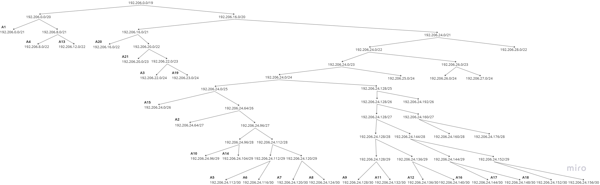

# Jarkom-Modul-4-D30-2023

## Group Member    :
| Nama                              | NRP        |
|-----------------------------------|------------|
|Abdullah Yasykur Bifadhlil Midror  |5025211035  |
|Muhammad Ahyun Irsyada             |5025211251  |

Berikut adalah demo laporan untuk praktikum modul 4

## Topologi
Topologi yang digunakan untuk praktikum modul 4 adalah sebagai berikut.
| 
 Topologi 
 |
| -------------------------------------------- |
|  |

## Variable Length Subnet Masking (VLSM)
Pada sesi ini kita akan membuat topologi kita pada Cisco Packet Tracer (CPT). Setelah membuat topologi, yang pertama kita lakukan selanjutnya adalah melakukan perhitungan untuk subnetting. Berikut langkah-langkahnya.

### Subnetting
- Lakukan pembagian untuk jumlah subnet yang ada pada topologi yang telah dibuat dan akan didapatkan pembagiannya sebagai berikut.

- Lakukan perhitungan terhadap jumah IP pada tiap-tiap subnet yang telah dibagi.

- Buat sebuah tree yang merepresentasikan pembagian ip dengan metode VLSM dari tiap-tiap subnet sebagaimana berikut.

**Penjelasan:**
- Pada pembagian subnet tercatat total ip adalah 4255 dan netmask yang cukup menampungnya adalah `/19` (menampung 8190 ip).
- Sehingga root dari tree memiliki netmask `/19` dengan ip yang dimulai dari `192.206.0.0`.
- Left child dari tree akan selalu menunjukkan awal mula dari ip yang tersedia, sedangkan right child adalah ip setelah ip left child.
- Iterasi dilakukan terus menerus mulai dari netmask `/19` hingga `/30`
- Sehingga pada akhirnya diperoleh pembagian IP dari tree VLSM tersebut sebagai berikut.

# Jarkom-Modul-4-D30-2023

## Group Member    :
| Nama                              | NRP        |
|-----------------------------------|------------|
|Abdullah Yasykur Bifadhlil Midror  |5025211035  |
|Muhammad Ahyun Irsyada             |5025211251  |

Berikut adalah demo laporan untuk praktikum modul 4

## Topologi
Topologi yang digunakan untuk praktikum modul 4 adalah sebagai berikut.
| 
 Topologi 
 |
| -------------------------------------------- |
|  |

## Variable Length Subnet Masking (VLSM)
Pada sesi ini kita akan membuat topologi kita pada Cisco Packet Tracer (CPT). Setelah membuat topologi, yang pertama kita lakukan selanjutnya adalah melakukan perhitungan untuk subnetting. Berikut langkah-langkahnya.

### Subnetting
- Lakukan pembagian untuk jumlah subnet yang ada pada topologi yang telah dibuat dan akan didapatkan pembagiannya sebagai berikut.

- Lakukan perhitungan terhadap jumah IP pada tiap-tiap subnet yang telah dibagi.

- Buat sebuah tree yang merepresentasikan pembagian ip dengan metode VLSM dari tiap-tiap subnet sebagaimana berikut.

**Penjelasan:**
- Pada pembagian subnet tercatat total ip adalah 4255 dan netmask yang cukup menampungnya adalah `/19` (menampung 8190 ip).
- Sehingga root dari tree memiliki netmask `/19` dengan ip yang dimulai dari `192.206.0.0`.
- Left child dari tree akan selalu menunjukkan awal mula dari ip yang tersedia, sedangkan right child adalah ip setelah ip left child.
- Iterasi dilakukan terus menerus mulai dari netmask `/19` hingga `/30`
- Sehingga pada akhirnya diperoleh pembagian IP dari tree VLSM tersebut sebagai berikut.

## CIDR (Classless Inter Domain Routing)
CIDR, atau Classless Inter-Domain Routing, adalah sebuah metode pengalamatan IP dan pengelompokan alamat IP untuk menggantikan sistem pengalamatan IP tradisional yang disebut sebagai kelas (Classful Network). CIDR diperkenalkan untuk mengatasi masalah pemborosan alamat IP yang terjadi dalam sistem kelas.

## Topologi untuk GNS3 
pada sesi CIDR topologi yang di gunakan adalah topologi menggunakn GNS3 yaitu : 

(poto) 

## Subnetting 
- Pertama tama kita gambar bagian bagian jumlah subnet yang ada pada topologi yang telah dibuat dan akan didapatkan pembagiannya sebagai berikut.
(poto)
- Lakukan perhitungan terhadap jumah IP pada tiap-tiap subnet yang telah dibagi.
	Penggabungan tingkat 1
	(poto)
	Penggabungan tingkat 2
	(poto)
	Penggabungan tingkat 3
  	(poto)
  	Penggabungan tingkat 4
  	(poto)
  	Penggabungan tingkat 5
  	(poto)
  	Penggabungan tingkat 6
- Buat sebuah tree yang merepresentasikan pembagian ip dengan metode VLSM dari tiap-tiap subnet sebagaimana berikut.
(poto)

*Penjelasan*
- Pada topologi Untuk melakukan perhitungan pada CIDR kita harus membagi bagi subnet mulai dari subnet yang paling bawah. Paling bawah berarti subnet yang paling jauh dari internet (gambar awan). Maka pada topologi yang digunakan, subnet yang dapat digabungkan adalah A1 dengan A2 dan subnet A7 dengan A8. Subnet yang digabung tersebut akan membentuk sebuah subnet lebih besar dari subnet-subnet kecil yang ada di dalamnya.  
- Pada setiap bagian subnet memiliki netmask yaitu host dalam bagian subnet yang memiliki netmask yang lebih besar di naikan satu tingkat lebih besar, contoh pada Subnet `B1` yang mana terdiri dari subnet `A1` dan `A5` yang mana memiliki netmask masing masing yaitu `/21` dan `/30`, dikarenakan subnet yang yang terbesar adalah `A1` dengan netmask `/21` maka netmask nya `B1` adalah `/20`
- Perbedaan antara pohon VLSM dengan pohon CIDR adalah ketika satu subnet diturunkan, netmask yang akan terbentuk disesuaikan dengan penggabungan subnet yang telah dilakukan sebelumnya.
- Iterasi dilakukan terus menerus mulai dari netmask `/16` hingga `/30`
- Sehingga pada akhirnya diperoleh pembagian IP dari tree VLSM tersebut sebagai berikut.
(poto)
