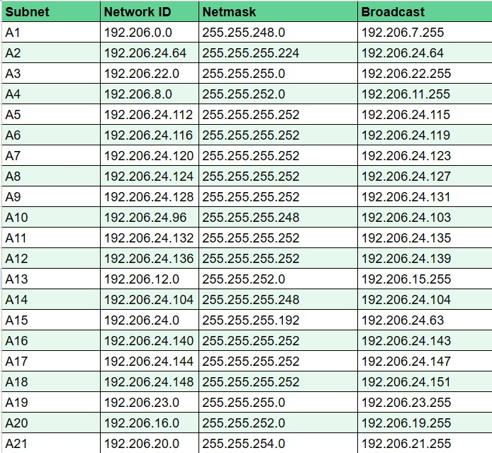
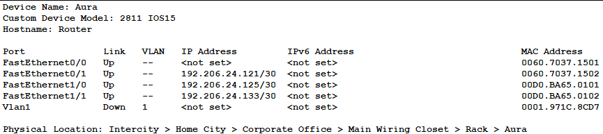
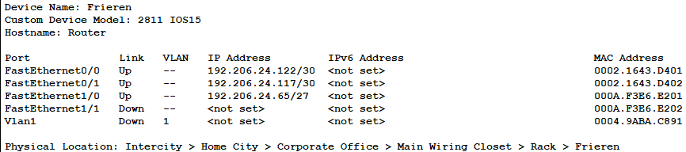
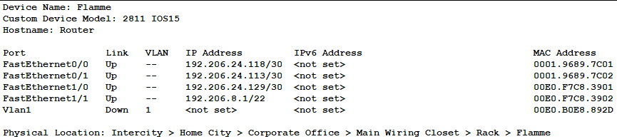
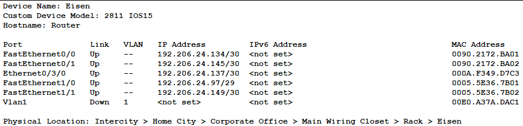
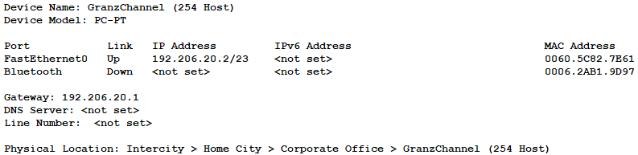

# Jarkom-Modul-4-D30-2023

## Group Member    :
| Nama                              | NRP        |
|-----------------------------------|------------|
|Abdullah Yasykur Bifadhlil Midror  |5025211035  |
|Muhammad Ahyun Irsyada             |5025211251  |

Berikut adalah demo laporan untuk praktikum modul 4

## Topologi
Topologi yang digunakan untuk praktikum modul 4 adalah sebagai berikut.
| 
 Topologi 
 |
| -------------------------------------------- |
|  |

## Variable Length Subnet Masking (VLSM)
Pada sesi ini kita akan membuat topologi kita pada Cisco Packet Tracer (CPT). Setelah membuat topologi, yang pertama kita lakukan selanjutnya adalah melakukan perhitungan untuk subnetting. Berikut langkah-langkahnya.

### Subnetting
- Lakukan pembagian untuk jumlah subnet yang ada pada topologi yang telah dibuat dan akan didapatkan pembagiannya sebagai berikut.

- Lakukan perhitungan terhadap jumah IP pada tiap-tiap subnet yang telah dibagi.

- Buat sebuah tree yang merepresentasikan pembagian IP dengan metode VLSM dari tiap-tiap subnet sebagaimana berikut.

**Penjelasan:**
- Pada pembagian subnet tercatat total IP adalah 4255 dan netmask yang cukup menampungnya adalah `/19` (menampung 8190 IP).
- Sehingga root dari tree memiliki netmask `/19` dengan IP yang dimulai dari `192.206.0.0`.
- Left child dari tree akan selalu menunjukkan awal mula dari ip yang tersedia, sedangkan right child adalah IP setelah IO left child.
- Iterasi dilakukan terus menerus mulai dari netmask `/19` hingga `/30`.
- Sehingga pada akhirnya diperoleh pembagian IP dari tree VLSM tersebut sebagai berikut.

- Langkah selanjutnya adalah melakukan config pada tiap node di CPT berdasarkan IP dan subnet yang telah didapatkan sebelumnya
- Untuk isi config pembagian IP akan diset seperti ini:
  * Router memliki `IP NID + 1`
  * Host / Client memiliki `IP Rourter + 1` atau `IP Client sesubnet + 1`
  * Host / Client memiliki gateway sesuai IP router dalam subnet mereka
  * 1 router bisa memiliki beberapa IP karena dalam 1 router dapat menangani beberapa ethernet interface / subnet
- Berikut adalah contoh, jika sudah selesai melakukan config maka akan muncul konfigurasi ketika node dihover.
  1. Aura (Router)
     
  2. Frieren (Router)
     
  3. Flamme (Router)
     
  4. Eisen (Router)
     
  5. GranzChannel (Client)
     
- Begitu juga untuk node yang lain menyocokkan dengan pembagian IP yang sudah dibagi sebelumnya.
